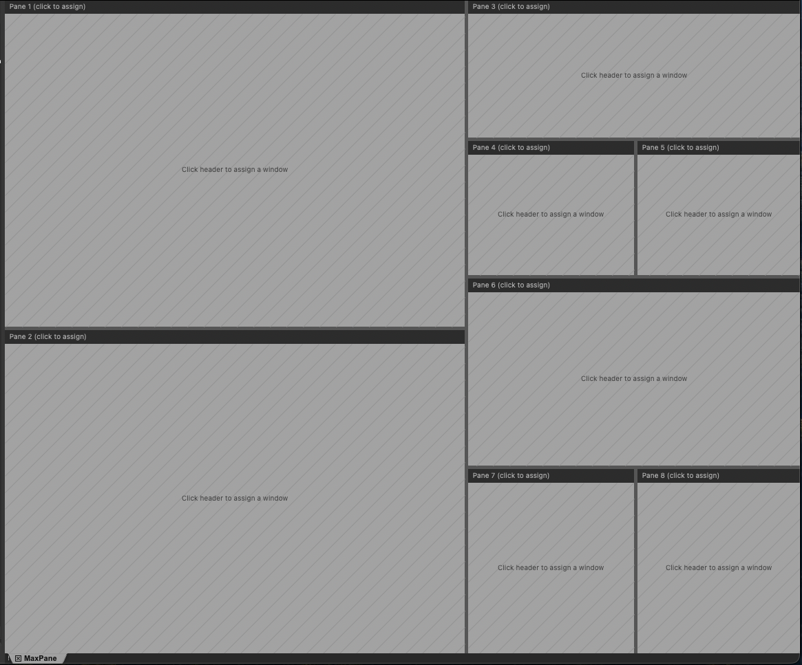
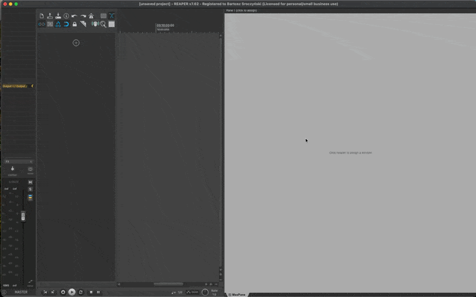
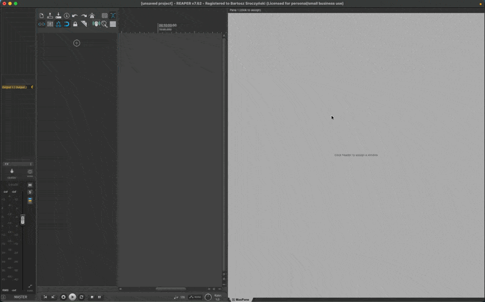
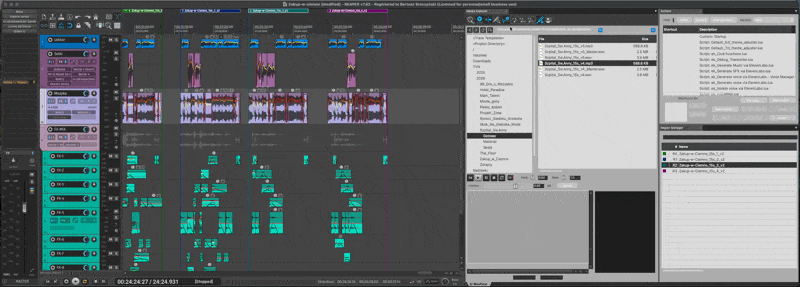
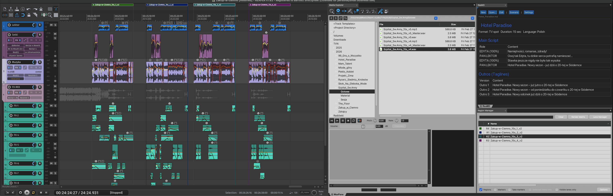

# MaxPane

**Nested docker layouts for REAPER** — a native C++ extension that lets you build custom multi-pane workspaces with tabbed windows, drag-and-drop, and instant workspace switching.



> *Capture any REAPER window — Media Explorer, FX Browser, Mixer, Actions, or even ReaImGui scripts — into a single tiling container with resizable split panes and tabbed panels.*

---

## Features

- **Flexible split layouts** — Split panes horizontally or vertically to any depth (up to 16 panes). Drag splitter bars to resize on the fly.
- **Tabbed windows** — Multiple windows per pane, with tab bar. Click tabs to switch, drag tabs between panes. Each tab bar has a **▼ menu button** for quick access to the pane context menu.
- **14 known REAPER windows** — One-click capture for Media Explorer, FX Browser, Actions, Mixer, Region Manager, Routing Matrix, Track Manager, Big Clock, Navigator, Undo History, Project Bay, Video, Virtual MIDI Keyboard, Performance Meter.
- **Arbitrary window capture** — Grab *any* open REAPER window, including third-party ReaImGui scripts (ReaMD, etc.), via the "Open Windows" submenu or click-to-capture mode.
- **Workspaces** — Save and restore complete layout snapshots (tree structure + captured windows) with a single click.
- **Favorites** — Pin frequently used windows for quick access across sessions.
- **Tab colors** — Color-code tabs with 8 palette colors for visual organization.
- **Layout presets** — Quick-start with 5 built-in layouts: Two Columns, Left + Right Split, Three Columns, 2x2 Grid, Top + Bottom Split.
- **Hover highlights** — Visual feedback on splitter bars and tabs when hovered.
- **Per-project state** — Layout is saved inside each .RPP project file, so different projects can have different MaxPane configurations.
- **Persistent state** — Layout, captured windows, favorites, and workspaces survive REAPER restarts.
- **Auto-open on startup** — Optionally restore MaxPane automatically when REAPER launches.
- **Dockable** — The container itself docks into REAPER's native docker system.
- **Zero dependencies** — Pure C++ extension using REAPER SDK + WDL/SWELL. No scripts, no ReaImGui, no js_ReaScriptAPI required.

## Screenshots

| Create grid layout | Assign windows to panes | Recall workspace |
|:---:|:---:|:---:|
|  |  |  |



## Installation

### ReaPack (recommended)

1. In REAPER, go to **Extensions > ReaPack > Import repositories...**
2. Paste this URL:
   ```
   https://github.com/b4s1c/MaxPane/raw/main/index.xml
   ```
3. Go to **Extensions > ReaPack > Browse packages**, search for **MaxPane**.
4. Right-click > **Install**, then restart REAPER.

ReaPack will automatically notify you of future updates.

### Manual install

1. Download `reaper_maxpane.dylib` (macOS) from the [Releases](../../releases) page.
2. Copy it to your REAPER resource path:

| Platform | Path |
|----------|------|
| **macOS** | `~/Library/Application Support/REAPER/UserPlugins/` |
| **Windows** | `%APPDATA%\REAPER\UserPlugins\` |
| **Linux** | `~/.config/REAPER/UserPlugins/` |

3. Restart REAPER.
4. Open via **Actions > MaxPane: Open Container**, or assign a keyboard shortcut.

### Build from source

See [Building](#building) below.

## Usage

1. **Open MaxPane** — Run the action "MaxPane: Open Container" from REAPER's Actions menu.
2. **Right-click** any pane header, or click the **▼ button** at the right of any tab bar, to open the pane context menu.
3. **Choose a window** from the Known Windows list, or browse Open Windows for any visible REAPER window.
4. **Split panes** via the context menu (Split Left/Right or Split Top/Bottom).
5. **Drag tabs** between panes to rearrange.
6. **Right-click a tab** to close it, move it, color it, or add it to Favorites.
7. **Save a workspace** via right-click > Workspaces > Save Current.
8. **Drag splitter bars** to resize panes.

## Building

### Prerequisites

- **CMake** 3.15+
- **C++17** compiler (Clang on macOS, GCC on Linux, MSVC on Windows)
- **REAPER SDK** — clone into `cpp/sdk/`:
  ```bash
  git clone https://github.com/justinfrankel/reaper-sdk.git cpp/sdk
  ```
- **WDL** — clone into `cpp/WDL/`:
  ```bash
  git clone https://github.com/cockos/WDL.git cpp/WDL
  ```

### Compile and install (macOS)

```bash
cd cpp/build
cmake .. -DCMAKE_BUILD_TYPE=Release
make
cp reaper_maxpane.dylib ~/Library/Application\ Support/REAPER/UserPlugins/
```

### Compile and install (Linux)

```bash
cd cpp/build
cmake .. -DCMAKE_BUILD_TYPE=Release
make
cp reaper_maxpane.so ~/.config/REAPER/UserPlugins/
```

### Compile and install (Windows)

```bash
cd cpp/build
cmake .. -G "Visual Studio 17 2022" -A x64
cmake --build . --config Release
copy Release\reaper_maxpane.dll "%APPDATA%\REAPER\UserPlugins\"
```

### Debug build

Debug builds enable verbose logging to `/tmp/maxpane_debug.log`:

```bash
cmake .. -DCMAKE_BUILD_TYPE=Debug
make
```

## Requirements

- **REAPER** 7.0+ (tested on 7.62)
- **macOS** arm64 (Apple Silicon) — primary platform, tested on macOS 26.3 Tahoe / Apple M1 Pro
- **Windows** x64 — architecture in place, **requires testing before release**
- **Linux** x86_64 — builds provided, testing in progress

## Architecture

```
cpp/src/
  main.cpp                  Entry point, API imports, action registration
  container.h               Container class declaration, shared structs (TabBarLayout, DragState, …)
  container.cpp             Lifecycle, DlgProc, context menus, OnTimer, OnPaneMenuButtonClick
  container_paint.cpp       OnPaint, DrawTabBar (rendering only)
  container_input.cpp       Mouse events, tab hit-testing, drag-and-drop, CalcTabBarLayout, GetTabRect
  container_state.cpp       SaveState, LoadState, ApplyPaneState, workspace save/load/delete
  split_tree.h/cpp          Binary tree layout engine (split/merge/drag/recalculate)
  window_manager.h/cpp      Window capture via SetParent, tab management (close/move/reposition)
  capture_queue.h/cpp       Async window capture with retry + dock frame detection
  favorites_manager.h/cpp   Persistent favorites with action command strings
  workspace_manager.h/cpp   State save/restore, named workspace snapshots
  context_menu.h/cpp        Context menu construction (pane + tab menus)
  config.h                  Constants: colors, geometry, timing, window definitions
  project_state.h/cpp       RPP chunk I/O (project_config_extension_t callbacks)
  state_accessor.h          Polymorphic StateAccessor for global/project/RPP state
  globals.h/cpp             REAPER API function pointers, safe_strncpy, helpers
  debug.h                   Conditional debug logging (Debug builds only)
```

The extension works by reparenting REAPER windows (via `SetParent`) into a custom container dialog. The container uses a binary split tree for layout, with each leaf node representing a pane that holds tabbed windows. Global state is persisted via REAPER's ExtState API; per-project state is saved inside `.RPP` files via `project_config_extension_t`.

## Recording screenshots & GIFs

To create visuals for this README and forum posts:

1. **[LICEcap](https://www.cockos.com/licecap/)** (by Cockos, the makers of REAPER) — Record animated GIFs directly. Ideal for a 5-second demo showing split/capture/drag workflow.
2. **Screenshots** — macOS: `Cmd+Shift+4` to select a region. Capture:
   - The full container with a multi-pane layout
   - Tab bar with colored tabs
   - Context menu open
   - Workspace save/load in action

Place images in `docs/images/` and update the image references at the top of this README.

## Contributing

Contributions are welcome! Please:

1. Fork the repository
2. Create a feature branch (`git checkout -b feature/my-feature`)
3. Make your changes and ensure the build compiles with zero warnings
4. Commit with a descriptive message
5. Push and open a Pull Request

See [open issues](../../issues) for ideas.

## License

[MIT](LICENSE) — Copyright (c) 2025–2026 b4s1c

## Links

- **REAPER** — https://www.reaper.fm
- **ReaPack** — https://reapack.com
- **REAPER SDK** — https://github.com/justinfrankel/reaper-sdk
- **WDL/SWELL** — https://github.com/cockos/WDL

<!-- TODO: Add forum thread link after posting -->
<!-- - **Forum thread** — https://forum.cockos.com/showthread.php?t=XXXXX -->
